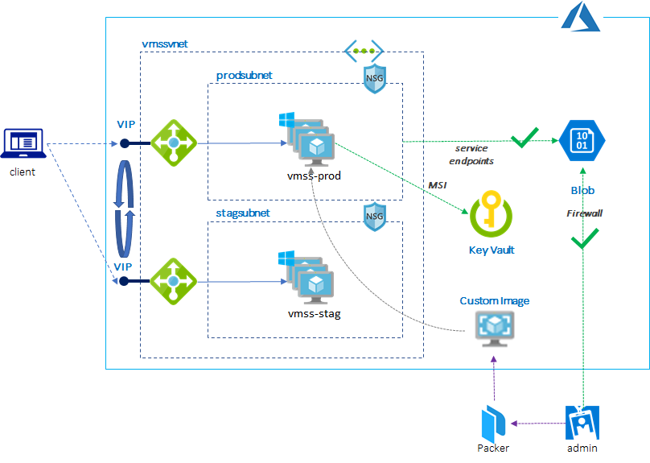

# .NET Core App Deployment to VMSS

This sample demonstrates how to deploy .NET Core App to VMSS in cloud native way.

- Build custom VM image by Packer
- Deploy to VMSS using VM image or VM extension
- Update/upgrade application using rolling update or VIP swap
- Config MSI (Managed Service Identity)
- .NET code sample to access KeyVault and Blob

## Topics

1. [Setup environment](./1_setup.md)
2. [Prepare App and Build VM Images](./2_build.md)
3. [Deploy app to VMSS](./3_deploy.md)
4. [Update/upgrade app](./4_update.md)
5. [Securely access Blob and Key Vault using MSI](./5_msi.md)